# Mini Project-2 Pemrograman Aplikasi Bergerak
## Nama: Moch. Farris Alfiansyah
## NIM: 2409116079

---

# 🚌 Manajemen_Data_Bus

## Deskripsi Aplikasi
Aplikasi Manajemen Data Bus dirancang untuk membantu pengguna dalam mengelola data kendaraan bus secara lebih terorganisir. Dengan aplikasi ini, pengguna dapat menyimpan dan mengelola informasi bus seperti nama bus, nomor polisi, jenis bus, tahun kendaraan, dan status operasional.

Selain itu, aplikasi ini juga menyediakan fitur Login dan Register menggunakan Supabase Authentication sehingga hanya pengguna yang terdaftar yang dapat mengakses sistem. Aplikasi juga mendukung Light Mode dan Dark Mode agar pengguna dapat menyesuaikan tampilan aplikasi sesuai preferensi mereka.

  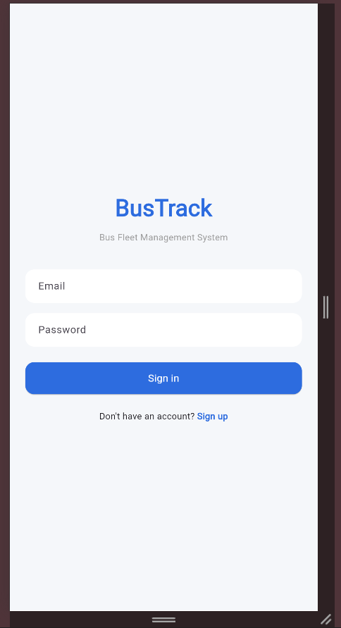

Halaman login digunakan untuk mengakses aplikasi dengan akun yang telah terdaftar.

## Fitur Aplikasi
Aplikasi Manajemen Data Bus memiliki beberapa fitur utama sebagai berikut:

### 🔐 Authentication
Fitur Authentication digunakan untuk mengatur proses identifikasi pengguna sebelum dapat mengakses sistem aplikasi.

  
  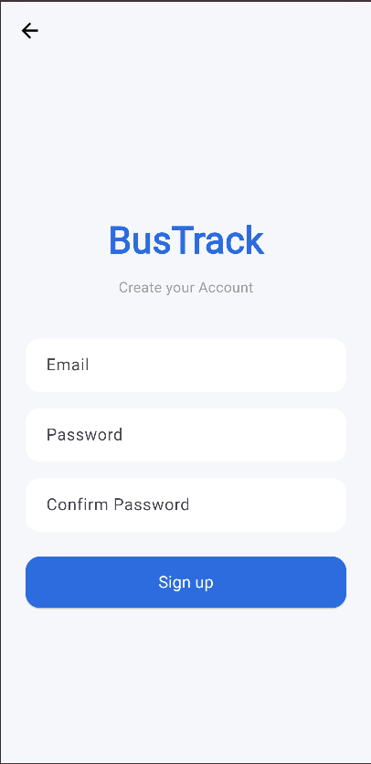
  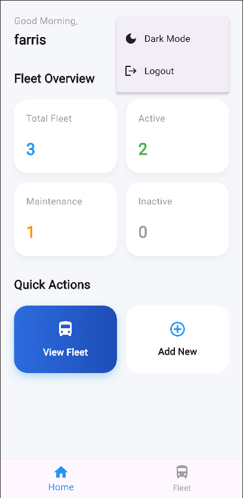

**1. Login pengguna**, Menu Login merupakan halaman yang digunakan oleh pengguna untuk masuk ke dalam aplikasi dengan memasukkan email dan kata sandi yang telah
terdaftar.Fitur ini berfungsi untuk memverifikasi identitas pengguna sehingga hanya pengguna yang memiliki akun yang dapat mengakses sistem.

**2. Register pengguna**, Menu Register merupakan halaman yang digunakan untuk mendaftarkan akun baru ke dalam sistem aplikasi. Pengguna diminta untuk mengisi beberapa data seperti email dan kata sandi yang kemudian akan disimpan pada sistem autentikasi.

**3. Logout pengguna**, Fitur Logout digunakan untuk keluar dari aplikasi dan mengakhiri sesi pengguna yang sedang aktif. Fungsi ini bertujuan untuk menjaga keamanan akun serta mencegah akses oleh pihak yang tidak berwenang.

--- 

### 🚌 Manajemen Data Bus (CRUD)
Fitur Manajemen Data Bus digunakan untuk mengelola seluruh data bus yang tersimpan di dalam sistem aplikasi.

  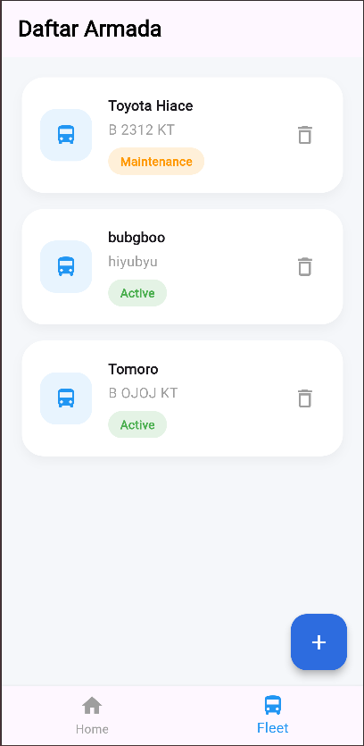
  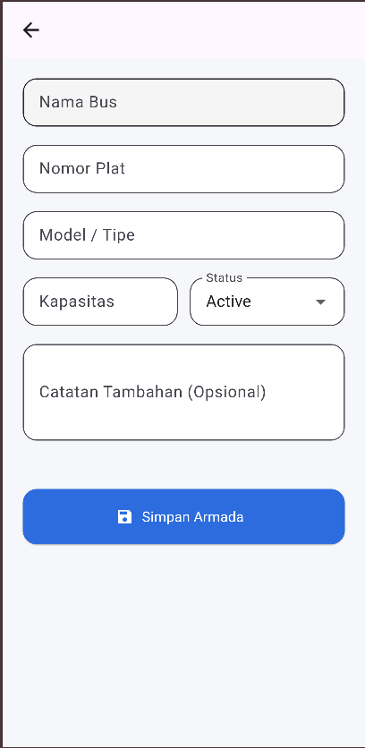
  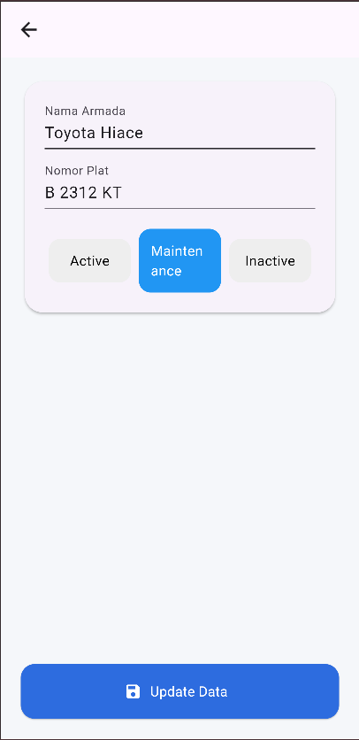
  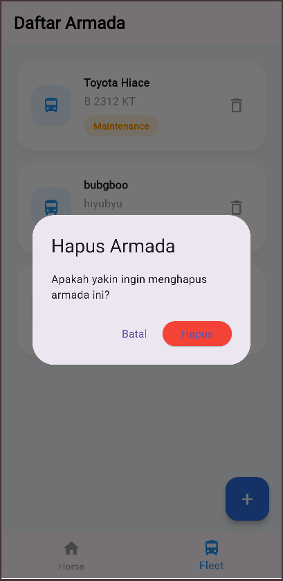

**1. Menampilkan Data Bus**, Fitur ini digunakan untuk menampilkan daftar seluruh data bus yang telah tersimpan di dalam sistem. Informasi yang ditampilkan meliputi nama bus, nomor plat, jenis bus, serta status operasional.

**2. Menambahkan Data Bus**, Fitur ini digunakan untuk menambahkan data bus baru ke dalam sistem. Pengguna dapat mengisi informasi bus melalui formulir yang tersedia.

**3. Mengubah Data Bus**, Fitur ini digunakan untuk memperbarui atau mengedit informasi bus yang telah tersimpan sebelumnya. Perubahan data akan langsung diperbarui dalam sistem setelah pengguna menyimpan perubahan.

**4. Menghapus Data Bus**, Fitur ini digunakan untuk menghapus data bus dari sistem aplikasi. Sebelum proses penghapusan dilakukan, sistem akan menampilkan konfirmasi untuk mencegah kesalahan penghapusan data.

---

## Widget yang Digunakan
Aplikasi Manajemen Data Bus dibangun menggunakan berbagai widget pada framework Flutter. Widget digunakan untuk membangun tampilan antarmuka serta mengatur
interaksi pengguna dengan aplikasi.

Berikut beberapa widget utama yang digunakan dalam pengembangan aplikasi ini.

### 🏗️ MaterialApp

  
  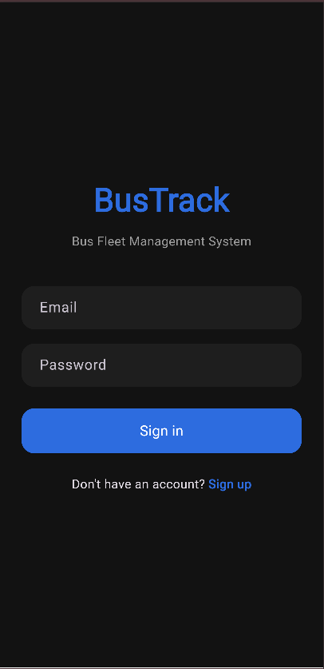

MaterialApp merupakan widget utama yang digunakan untuk menjalankan aplikasi berbasis Material Design. Pada aplikasi Manajemen Data Bus, widget ini berada pada file main.dart dan berfungsi untuk mengatur konfigurasi aplikasi seperti tema (Light Mode dan Dark Mode), navigasi halaman, serta halaman awal aplikasi.

### 🧱 Scaffold
Scaffold digunakan sebagai kerangka dasar halaman aplikasi.
Widget ini menyediakan struktur layout yang terdiri dari AppBar, Body, FloatingActionButton, dan komponen lainnya sehingga memudahkan dalam menyusun tampilan halaman.

  
  
  
  

Widget ini digunakan pada hampir seluruh halaman seperti:

- Login Page
- Register Page
- Armada Page
- Add Armada Page
- Edit Armada Page

### 📌 AppBar
AppBar merupakan widget yang digunakan untuk menampilkan bilah navigasi di bagian atas halaman aplikasi. Biasanya widget ini berisi judul halaman, tombol navigasi kembali, serta ikon menu lainnya.

  
  
  

Pada aplikasi ini, AppBar digunakan pada halaman:

- Daftar Bus
- Tambah Bus
- Edit Bus

### 📄 ListView.builder
ListView.builder digunakan untuk menampilkan data dalam bentuk daftar yang dapat digulir secara vertikal. Widget ini sangat efisien untuk menampilkan data dalam jumlah banyak karena hanya akan merender item yang tampil di layar.

  

Pada aplikasi ini, widget ini digunakan untuk menampilkan daftar data bus.

### 🧾 Card
Card merupakan widget yang digunakan untuk menampilkan informasi dalam bentuk kartu dengan tampilan yang lebih rapi dan terstruktur.

  

Pada aplikasi ini, setiap data bus ditampilkan menggunakan widget Card agar informasi bus lebih mudah dibaca oleh pengguna.

### 📝 Form
Form digunakan untuk mengelompokkan beberapa komponen input dalam satu formulir. Widget ini biasanya digunakan pada halaman yang memerlukan input data dari pengguna.

  
  
  
  

Pada aplikasi ini, Form digunakan pada halaman:

- Login
- Register
- Tambah Bus
- Edit Bus

### ✏️ TextFormField
TextFormField merupakan widget input yang digunakan untuk menerima data teks dari pengguna. Widget ini juga mendukung fitur validasi input untuk memastikan data yang dimasukkan sesuai dengan ketentuan yang ditetapkan.

  
  

Contoh penggunaan pada aplikasi ini:

- Input email saat login
- Input password saat login
- Input nama bus
- Input nomor polisi

### 🔘 ElevatedButton
ElevatedButton merupakan widget tombol yang digunakan untuk menjalankan suatu aksi ketika ditekan oleh pengguna.

  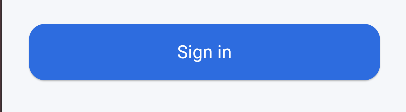
  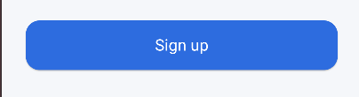
  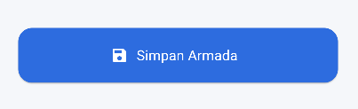
  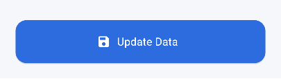

Pada aplikasi ini, tombol ini digunakan untuk beberapa fungsi seperti:

- Login
- Register
- Menyimpan data bus
- Memperbarui data bus

### 🔄 Navigator
Navigator digunakan untuk mengatur perpindahan antar halaman dalam aplikasi.

Widget ini memungkinkan pengguna berpindah dari satu halaman ke halaman lainnya, misalnya:

- dari halaman daftar bus ke halaman tambah bus
- dari halaman tambah bus kembali ke halaman daftar bus

### 📦 Provider (State Management)
Provider merupakan salah satu metode state management yang digunakan untuk mengelola data aplikasi serta memperbarui tampilan ketika data berubah.

Dalam aplikasi Manajemen Data Bus, Provider digunakan untuk:

- Mengelola data bus
- Menyimpan daftar bus dalam aplikasi
- Memperbarui tampilan daftar bus secara otomatis ketika data berubah

---

## Nilai Tambah
Di sini saya menggunakan beberapa fitur sebagai nilai tambah.

### 🔐 Login & Register menggunakan Supabase Auth

  
  

**Fitur Login** digunakan oleh pengguna untuk masuk ke dalam aplikasi dengan memasukkan alamat surel dan kata sandi yang telah terdaftar sebelumnya. Sistem kemudian akan melakukan proses verifikasi terhadap data pengguna melalui layanan Supabase.

**Fitur Register** digunakan untuk membuat akun pengguna baru. Pada proses ini, pengguna diminta untuk mengisi data berupa alamat surel dan kata sandi yang kemudian akan disimpan pada sistem autentikasi Supabase.

  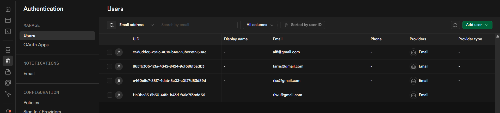

Aplikasi ini menggunakan layanan Supabase Authentication sebagai sistem autentikasi pengguna. Layanan ini digunakan untuk mengelola proses pendaftaran akun serta proses masuk pengguna ke dalam aplikasi secara aman.

Penggunaan Supabase Authentication bertujuan untuk memastikan bahwa hanya pengguna yang memiliki akun yang dapat mengakses aplikasi.

### 🌙 Light Mode dan Dark Mode
Aplikasi Manajemen Data Bus menyediakan dua pilihan tema tampilan antarmuka, yaitu Light Mode dan Dark Mode. Fitur ini memungkinkan pengguna untuk menyesuaikan tampilan aplikasi sesuai dengan kebutuhan dan kenyamanan saat menggunakan aplikasi.

**Light Mode**

  
  
  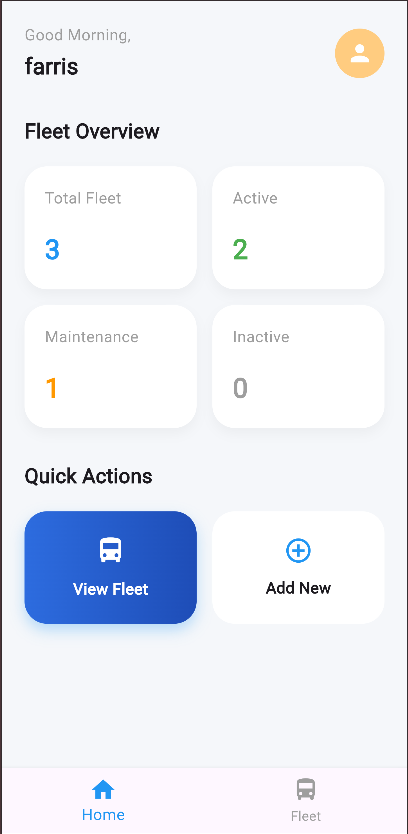
  
  
  
  
  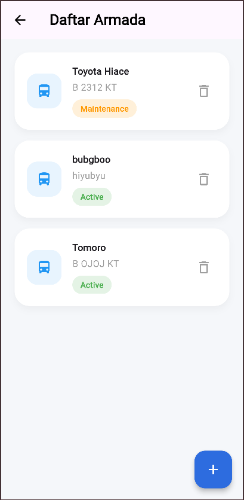
  

**Dark Mode**

  
  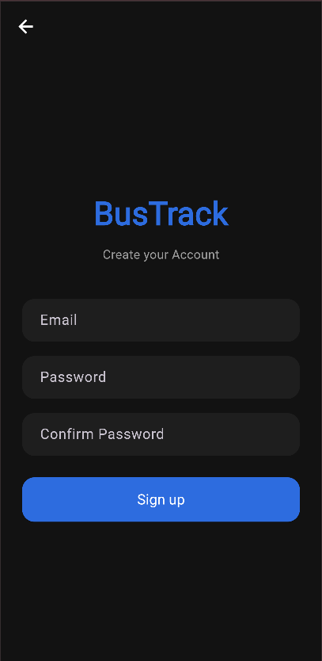
  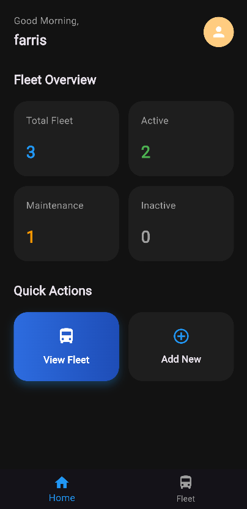
  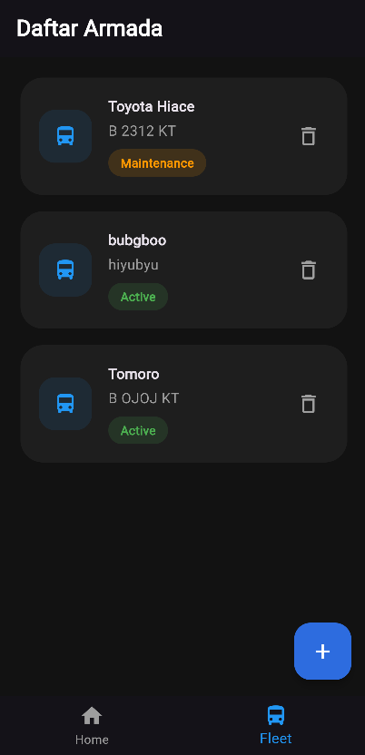
  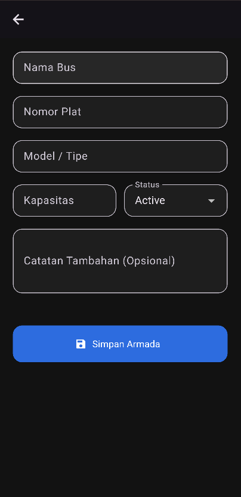
  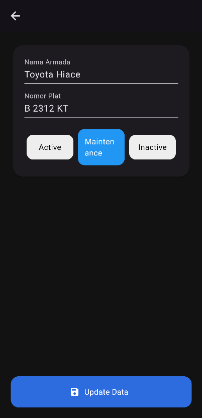
  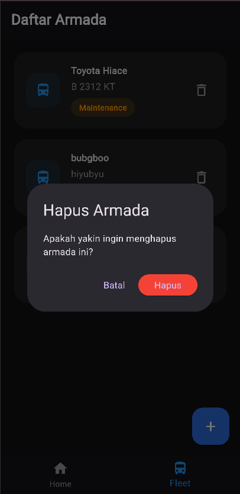
  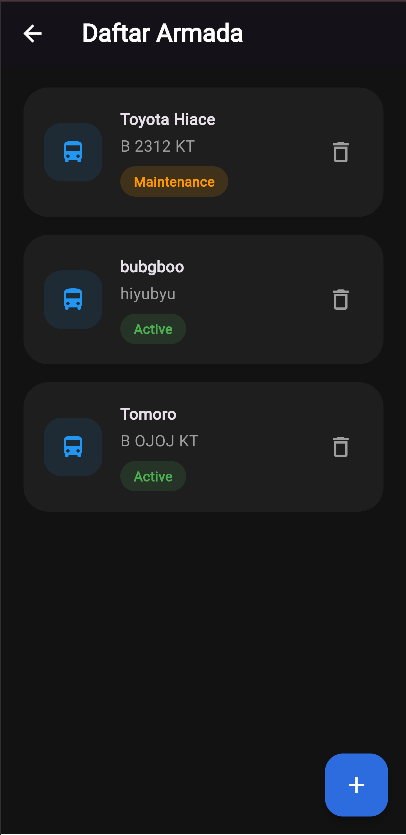
  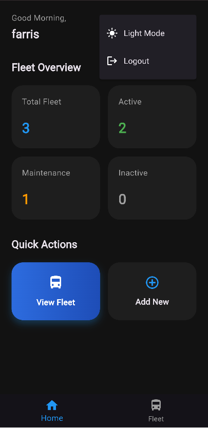

Mode terang (Light Mode) menampilkan antarmuka dengan latar belakang berwarna terang sehingga memudahkan pengguna dalam membaca informasi pada kondisi pencahayaan normal. Sementara itu, mode gelap (Dark Mode) menampilkan antarmuka dengan latar belakang gelap yang bertujuan untuk mengurangi intensitas cahaya layar, terutama ketika aplikasi digunakan pada kondisi minim pencahayaan.

### 🔑 Penggunaan File Konfigurasi .env
Aplikasi ini menggunakan file konfigurasi lingkungan dengan format .env untuk menyimpan data konfigurasi yang bersifat sensitif, seperti alamat layanan backend dan kunci akses API.

Penggunaan file .env bertujuan untuk memisahkan informasi konfigurasi dari kode sumber aplikasi sehingga keamanan data dapat lebih terjaga serta memudahkan proses pengelolaan konfigurasi aplikasi.
