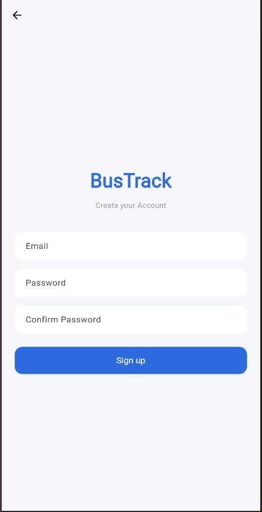

# 🚌 Manajemen_Data_Bus

## Deskripsi Aplikasi
Aplikasi Manajemen Data Bus dirancang untuk membantu pengguna dalam mengelola data kendaraan bus secara lebih terorganisir. Dengan aplikasi ini, pengguna dapat menyimpan dan mengelola informasi bus seperti nama bus, nomor polisi, jenis bus, tahun kendaraan, dan status operasional.

Selain itu, aplikasi ini juga menyediakan fitur Login dan Register menggunakan Supabase Authentication sehingga hanya pengguna yang terdaftar yang dapat mengakses sistem. Aplikasi juga mendukung Light Mode dan Dark Mode agar pengguna dapat menyesuaikan tampilan aplikasi sesuai preferensi mereka.

  
  

Halaman login digunakan untuk mengakses aplikasi dengan akun yang telah terdaftar.

## Fitur Aplikasi
Aplikasi Manajemen Data Bus memiliki beberapa fitur utama sebagai berikut:

### 🔐 Authentication

## Widget yang Digunakan
## Nilai Tambah
